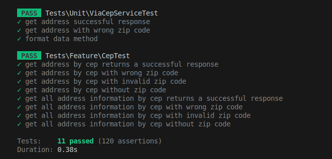
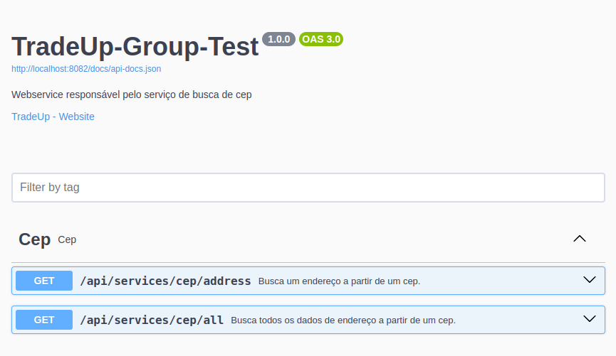

<p align="center"><a href="https://www.tradeupgroup.com" target="_blank"></a></p>

# Avaliação Técnica - TradeUp Group

Esse é um teste técnico para a vaga de **Backend** para a empresa **TradeUp Group**.

## Requisitos

Criar uma aplicação em **PHP**, que realiza uma consulta de **CEP** a partir de uma API externa.
Para a criação da aplicação foi utilizado o framework [Laravel 11](https://laravel.com/).

### Frontend (Opicional)

É necessário ter pelo menos duas páginas:
- HOME - Página principal do mini sistema, com uma descrição, imagem principal e botão para a página **CONSULTA CEP**
- CONSULTA CEP - Página com um campo para pesquisa do CEP (que aceite somente números, somente no formato de um cep), que retorna o endereço do cep pesquisado, amigavelmente, um botão voltar, que volta para a página de **HOME**.

### Backend

Será realizado utilizando o framework laravel, e será o responsável por consumir a API externa para a consulta de cep.


## Funcionalidades

- [x] Consultar CEP
- [x] Utilizar o Cache para persistir os CEP's já pesquisados
- [x] Realizar os testes unitários (Unit)
- [x] Realizar os testes de integração (Feature)

## Variáveis de Ambiente

Para rodar esse projeto, você vai precisar adicionar as seguintes variáveis de ambiente no seu .env


- `APP_NAME=TradeUp-Group-Test`
- `APP_LOCALE=pt_BR`
- `APP_FALLBACK_LOCALE=pt_BR`
- `APP_FAKER_LOCALE=pt_BR`
- `REDIS_CLIENT=phpredis`
- `REDIS_HOST=redis`
- `REDIS_PASSWORD=null`
- `REDIS_PORT=6379`
- `REDIS_QUEUE_CONNECTION=default`
- `REDIS_QUEUE=default`
- `VERSION=1.0.0`


## Instalação

A partir de um ambiente de desenvolvimento composto pelo PHP na versão 8.2 ou superior e com o Composer instalado execute o comando dentro da pasta do projeto.

Este projeto utiliza o [Docker](https://www.docker.com/) e o [Docker Compose](https://docs.docker.com/compose/) para o desenvolvimento e deploy local. Antes de executar o comando abaixo verifique se você possui a última versão do **Docker** e do **Docker Compose** respectivamente:

```bash
  docker-compose up -d --build
```
    
## Rodando os testes

Para rodar os testes, execute o comando dentro do container `app`:

```bash
  php artisan test
```

ou

```bash
  docker-compose exec app php artisan test
```

<p align="center"></p>

## Documentação

- [PHP](https://www.php.net/manual/pt_BR/index.php)
- [Laravel](https://laravel.com/docs)
- [Composer](https://getcomposer.org/)


## Documentação da API

A documentação da API é gerada através do [Swagger](https://swagger.io/) pela biblioteca `darkaonline/l5-swagger`. 

É possível utilizar e testar as API's a partir do link [/api/documentation](http://localhost:8082/api/documentation).

<p align="center"></p>

#### Retorna um endereço

```http
  GET /api/services/cep/address
```

| Parâmetro   | Tipo       | Descrição                           |
| :---------- | :--------- | :---------------------------------- |
| `cep` | `string` | **Obrigatório**. O Cep que será buscado |

#### Retorna todos os itens de um endereço

```http
  GET /api/services/cep/all
```

| Parâmetro   | Tipo       | Descrição                                   |
| :---------- | :--------- | :------------------------------------------ |
| `cep`      | `string` | **Obrigatório**. O Cep que será buscado |

## Stack utilizada

**Back-end:** Laravel, PHP


## Autores

- [Github - @danilo-righetto](https://github.com/danilo-righetto)
- [Linkedin - @danilo-righetto](https://www.linkedin.com/in/danilo-righetto/)

## Licença

Esta aplicação é um software de código aberto licenciado pelo [MIT license](https://opensource.org/licenses/MIT).

